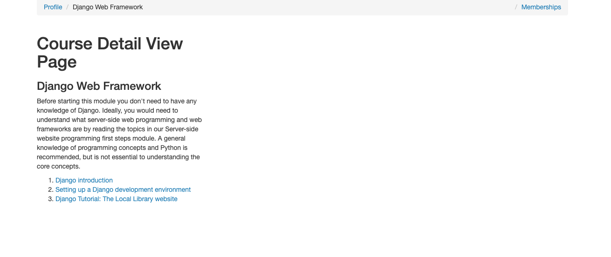
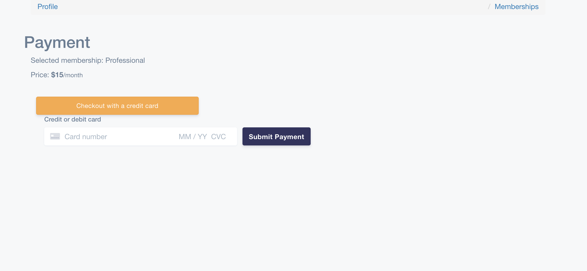

## video_memebership_website
A video sharing platform that offers a subscription based model, where consumers get access to video contents based on status of subscriptions.

• Used Python Django as the back-end framework to create a video membership website which allows user hosting membership contents. \
• Use Bootstrap CDN as a front-end framework to create a responsive design website that can compatible with all major browsers and platforms. \
• Use Stripe API to integrate payment processing into the website.

## Demo
course page

membership page

payment page

